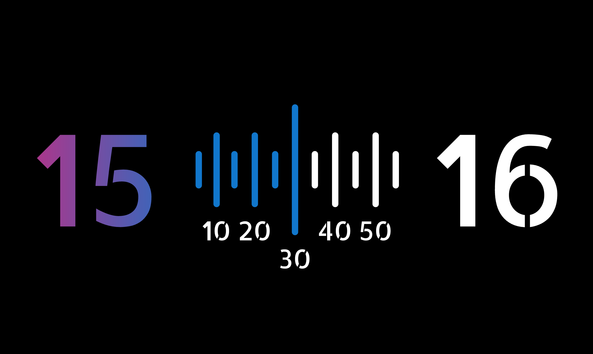
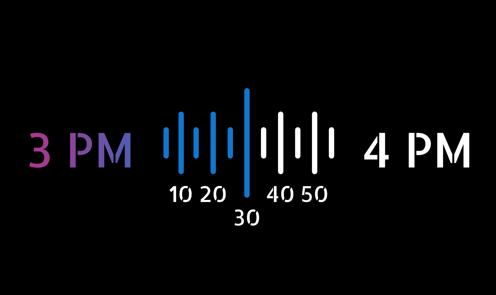
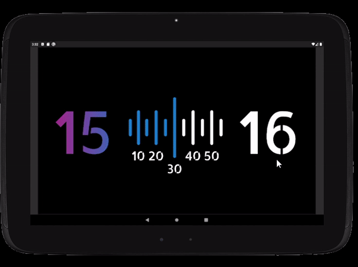

# Flutter Clock Face UI

Lenovo Smart Clock face UI for [Flutter Clock challenge](https://flutter.dev/clock) by Google Assistant and Lenovo.

## Styling and Customization
The UI is kept purposefully minimal so that user can focus on the main clock function. However, some options can be customized, such us:
* Time format
* Theme

## Examples

|  | 24-hour format | 12-hour format |
|---------------------|----------------|----------------|
| **Dark theme** |  |  |
| **Light theme** |  |  |

## Demo

## License
This project is licensed under the terms of the [MIT License](digital_clock/LICENSE.md).